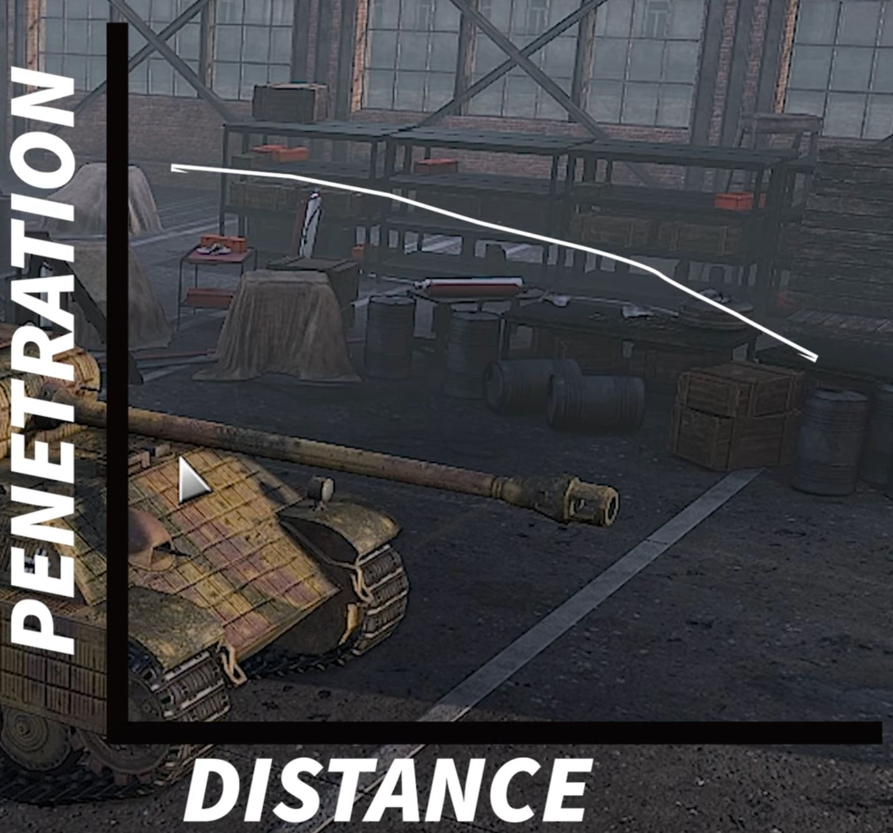

# Einheiten

Diese Auflistung orientiert sich an den Videos "Divisional Overview" und "How not to suck in SD2".

Hier werden allgemeine Informationen zum Aufbau von Divisionen notiert.

## Arten

- Aufklärung (Recon)
- Panzer (Tank)
- Infanterie (Infantry)
- Unterstützung (Support)
- Anti-Panzer (Anti-tank)
- Flugabwehr (Anti-air)
- Artillerie (Artillery)
- Flugzeuge (Air)

## Aufklärung

- recon squad
  - WLA DT
    - Wahrscheinlichkeit, entdeckt oder getötet zu werden, sehr hoch
- armored recon squad
- sniper team: very strong
- recon tank

## Panzer

- Light tank
  - <8 Leben
- Medium tank
  - 10 Leben
- Heavy tank
  - 12 Leben
  - meistens für lange Distanzen geeignet (wie z. B. Tiger E)
  - use sparingly
  - not for pushing
  - als Unterstützung und für das Durchbrechen von Gegnerpanzerung gedacht

### Ranges

Possible ranges: 1.000, 1.250, 1.500, 1.750, 2.000

### Generelle Tipps

- Panzer sollten nicht voranschreitend in Städte hinein. Dafür sind Infanterie gedacht.
- Panzer halten offene Flächen oder Straßen

## Infanterie

- Assault squad (submachine guns) --> close range squad
- Rifle squad
  - Grenadier squad
  - Panzergrenadier --> long range, nicht für die Erkundung von Wäldern geeignet, am Rand von Wäldern platzieren
- Assault engineers (Flamers)
- Engineers --> efficient in forests
- Kommandeur (Leader) =/= Kommandant (Commander)!

## Anti-Panzer

- Infanterie-Truppen dieser Kategorie sollten sich in Wäldern oder Häusern verstecken, um ein herannahendes Fahrzeug zu überraschen. Sie sind nicht für offenes Feld geeignet (höchstens bei einer Straße mit viel Weitsicht, auf der Trucks abgefangen werden können).

## Flugabwehr

- light
  - 20 bis 25 mm
- medium
  - 37 bis 40 mm
  - good mix between suppression and shooting the enemy plane down
- heavy
  - 75 bis 80 mm
  - Flugzeuge daran hindern, Bomben abzuwerfen
  - schießt langsam

### Verwendung

- Nicht an der Front
- Möglichst oft bewegen (z. B. nach jedem Schuss), da diese ein gesuchtes Ziel von Mörsern sind

## Artillerie

- Mörser (Mortar team)
- Haubitze (Howitzer)
- Nebelwerfer (MLRS)

### Verwendung

Artillerie benötigt einen Versorgungstruck.

- leichte Artillerie: unter 100 mm
- mittlere Artillerie: von 105 bis 120 mm
- schwere Artillerie: 150 mm und größer
  - nicht unbedingt dazu geeignet, um Feinde auszuschalten, da sehr langsam

## Flugzeuge

- recon planes
- fighters
- fighter-bombers
- light bombers
